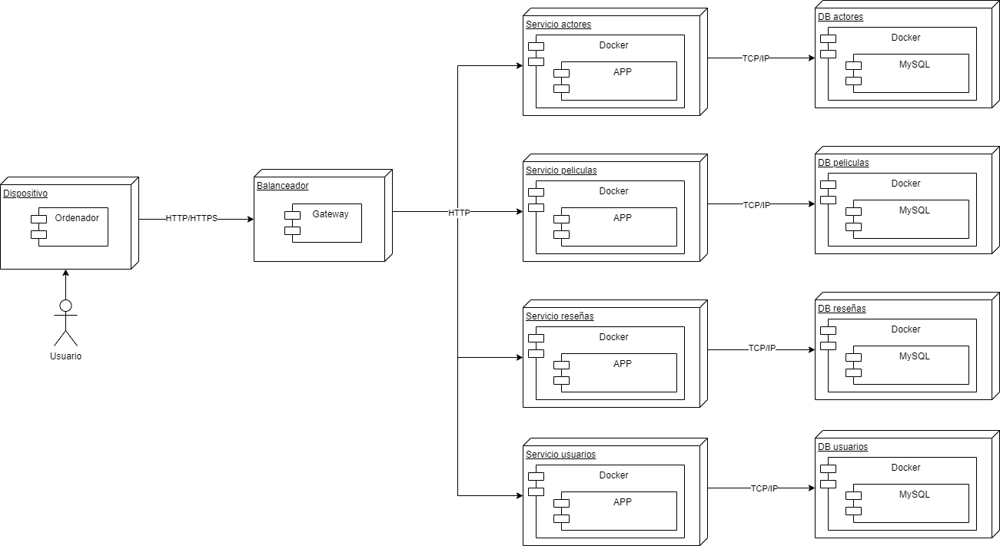

<p>UNIVERSIDAD DE SAN CARLOS DE GUATEMALA</p>
<p>FACULTAD DE INGENIERIA</p>
<p>ESCUELA DE CIENCIAS Y SISTEMAS</p>
<p>SOFTWARE AVANZADO</p>
<p>TUTOR: DIEGO MOLINA</p>

---

---

---

---

---

---

---

### <center><h1>PRACTICA 6</h1></center>
<center>Implementacion y
uso de kubernetes</center>

---

---

---

---

| NOMBRE                      | CARNET    |
|-----------------------------|:---------:|
| ERICK ABDUL CHACON BARILLAS | 201807169 |

---

---

---

---

---

---

---

---

---

---

## Arranque y estado del cluster

```bash
minikube start --driver=docker
minikube status
kubectl get nodes -o wide
```

## Namespaces y recursos

```bash
kubectl apply -f k8s/namespace.yaml
kubectl -n sa-p5 get pods,svc
kubectl config set-context --current --namespace=sa-p5
```

## Despliegues (manifiestos)

```bash
kubectl apply -f k8s/mysql/
kubectl apply -f k8s/actors/
kubectl apply -f k8s/movies/
kubectl apply -f k8s/reviews/
kubectl apply -f k8s/users/
kubectl apply -f k8s/gateway/
```

## Probando desde el host (port-forward)

```bash
kubectl -n sa-p5 port-forward svc/gateway 8080:80 &
```

## Metricas y HPA

```bash
minikube addons enable metrics-server
kubectl -n sa-p5 top pods
kubectl -n sa-p5 get hpa
kubectl -n sa-p5 run loadgen --image=curlimages/curl:8.10.1 --restart=Never -- \
  sh -c 'while true; do curl -s http://gateway/api/actors/listar >/dev/null; done'
kubectl -n sa-p5 get hpa -w
kubectl -n sa-p5 delete pod loadgen
```

## Cronjob (creacion, monitoreo y prueba manual)

```bash
kubectl apply -f k8s/cronjob/cron-configmap.yaml
kubectl apply -f k8s/cronjob/cronjob.yaml
kubectl -n sa-p5 get cronjob
kubectl -n sa-p5 get jobs -w

# Disparar un job manual (sin esperar al cron):
kubectl -n sa-p5 create job --from=cronjob/cron-insert cron-insert-manual
kubectl -n sa-p5 logs -l job-name=cron-insert-manual --follow
kubectl -n sa-p5 delete job cron-insert-manual
```

## MySQL desde el pod

```bash
MYSQL_POD=$(kubectl -n sa-p5 get pod -l app=mysql -o jsonpath='{.items[0].metadata.name}')
kubectl -n sa-p5 exec -it "$MYSQL_POD" -- bash -lc \
 'mysql -uroot -p"$MYSQL_ROOT_PASSWORD" -e "USE cron_db; SELECT * FROM cron_runs ORDER BY id DESC LIMIT 10;"'
```

## Depuracion

```bash
kubectl -n sa-p5 logs deploy/gateway --tail=200
kubectl -n sa-p5 describe pod <pod>
kubectl -n sa-p5 rollout restart deploy/<svc>
```

## Archivos YAML de cada despliegue

* Namespace

```yaml
apiVersion: v1
kind: Namespace
metadata:
  name: sa-p5
  labels:
    app.kubernetes.io/part-of: sa-p5
    environment: local
```

* MySQL

**configmap-init.yaml**

```yaml
apiVersion: v1
kind: ConfigMap
metadata:
  name: mysql-init
  namespace: sa-p5
data:
  actors.sql: |
    CREATE DATABASE IF NOT EXISTS actors_db;
    USE actors_db;
    CREATE TABLE IF NOT EXISTS actors (
      id INT PRIMARY KEY AUTO_INCREMENT,
      name VARCHAR(255) NOT NULL,
      birth_year INT
    );
```

**deployment.yaml**

```yaml
apiVersion: apps/v1
kind: Deployment
metadata:
  name: mysql
  namespace: sa-p5
spec:
  replicas: 1
  selector:
    matchLabels:
      app: mysql
  template:
    metadata:
      labels:
        app: mysql
    spec:
      containers:
        - name: mysql
          image: mysql:8.0
          ports:
            - containerPort: 3306
          env:
            - name: MYSQL_ROOT_PASSWORD
              valueFrom:
                secretKeyRef: { name: mysql-secret, key: MYSQL_ROOT_PASSWORD }
            - name: MYSQL_DATABASE
              value: actors_db
            - name: MYSQL_USER
              valueFrom:
                secretKeyRef: { name: mysql-secret, key: MYSQL_USER }
            - name: MYSQL_PASSWORD
              valueFrom:
                secretKeyRef: { name: mysql-secret, key: MYSQL_PASSWORD }
          volumeMounts:
            - name: mysql-data
              mountPath: /var/lib/mysql
            - name: init-sql
              mountPath: /docker-entrypoint-initdb.d
          resources:
            requests:
              cpu: "100m"
              memory: "256Mi"
            limits:
              cpu: "500m"
              memory: "512Mi"
      volumes:
        - name: mysql-data
          persistentVolumeClaim:
            claimName: mysql-pvc
        - name: init-sql
          configMap:
            name: mysql-init
```

**pvc.yaml**

```yaml
apiVersion: v1
kind: PersistentVolumeClaim
metadata:
  name: mysql-pvc
  namespace: sa-p5
spec:
  accessModes:
    - ReadWriteOnce
  resources:
    requests:
      storage: 1Gi
  storageClassName: standard
```

**secret.yaml**

```yaml
apiVersion: v1
kind: Secret
metadata:
  name: mysql-secret
  namespace: sa-p5
type: Opaque
stringData:
  MYSQL_ROOT_PASSWORD: rootpw
  MYSQL_USER: appuser
  MYSQL_PASSWORD: apppass
```

**service.yaml**

```yaml
apiVersion: v1
kind: Service
metadata:
  name: mysql
  namespace: sa-p5
spec:
  selector:
    app: mysql
  ports:
    - port: 3306
      targetPort: 3306
```

* Actors

**deployment.yaml**

```yaml
apiVersion: apps/v1
kind: Deployment
metadata:
  name: actors
  namespace: sa-p5
spec:
  replicas: 2
  selector:
    matchLabels: { app: actors }
  template:
    metadata:
      labels: { app: actors }
    spec:
      containers:
        - name: actors
          image: ms-actors:dev
          imagePullPolicy: IfNotPresent
          ports:
            - containerPort: 4000
          env:
            - name: PORT
              value: "4000"
            - name: DB_HOST
              value: "mysql.sa-p5.svc.cluster.local"
            - name: DB_PORT
              value: "3306"
            - name: DB_NAME
              value: "actors_db"
            - name: DB_USER
              valueFrom: { secretKeyRef: { name: mysql-secret, key: MYSQL_USER } }
            - name: DB_PASSWORD
              valueFrom: { secretKeyRef: { name: mysql-secret, key: MYSQL_PASSWORD } }
          readinessProbe:
            httpGet: { path: /healthz, port: 4000 }
            initialDelaySeconds: 5
            periodSeconds: 5
          livenessProbe:
            httpGet: { path: /healthz, port: 4000 }
            initialDelaySeconds: 10
            periodSeconds: 10
          resources:
            requests: { cpu: "100m", memory: "128Mi" }
            limits:   { cpu: "300m", memory: "256Mi" }
```

**hpa.yaml**

```yaml
apiVersion: autoscaling/v2
kind: HorizontalPodAutoscaler
metadata:
  name: actors
  namespace: sa-p5
spec:
  scaleTargetRef:
    apiVersion: apps/v1
    kind: Deployment
    name: actors
  minReplicas: 1
  maxReplicas: 2
  metrics:
    - type: Resource
      resource:
        name: cpu
        target:
          type: Utilization
          averageUtilization: 80
```

**service.yaml**

```yaml
apiVersion: v1
kind: Service
metadata:
  name: actors
  namespace: sa-p5
spec:
  selector: { app: actors }
  ports:
    - port: 4000
      targetPort: 4000
  type: ClusterIP
```

* Movies

**deployment.yaml**

```yaml
apiVersion: apps/v1
kind: Deployment
metadata:
  name: movies
  namespace: sa-p5
spec:
  replicas: 2
  selector:
    matchLabels: { app: movies }
  template:
    metadata:
      labels: { app: movies }
    spec:
      containers:
        - name: movies
          image: ms-movies:dev
          imagePullPolicy: IfNotPresent
          ports:
            - containerPort: 3000
          env:
            - name: PORT
              value: "3000"
            - name: DB_HOST
              value: "mysql.sa-p5.svc.cluster.local"
            - name: DB_PORT
              value: "3306"
            - name: DB_NAME
              value: "movies_db"
            - name: DB_USER
              valueFrom: { secretKeyRef: { name: mysql-secret, key: MYSQL_USER } }
            - name: DB_PASSWORD
              valueFrom: { secretKeyRef: { name: mysql-secret, key: MYSQL_PASSWORD } }

          readinessProbe:
            httpGet: { path: /healthz, port: 3000 }
            initialDelaySeconds: 5
            periodSeconds: 5
          livenessProbe:
            httpGet: { path: /healthz, port: 3000 }
            initialDelaySeconds: 10
            periodSeconds: 10
          resources:
            requests: { cpu: "100m", memory: "128Mi" }
            limits:   { cpu: "300m", memory: "256Mi" }
```

**hpa.yaml**

```yaml
apiVersion: autoscaling/v2
kind: HorizontalPodAutoscaler
metadata:
  name: movies
  namespace: sa-p5
spec:
  scaleTargetRef:
    apiVersion: apps/v1
    kind: Deployment
    name: movies
  minReplicas: 1
  maxReplicas: 2
  metrics:
    - type: Resource
      resource:
        name: cpu
        target:
          type: Utilization
          averageUtilization: 80
```

**service.yaml**

```yaml
apiVersion: v1
kind: Service
metadata:
  name: movies
  namespace: sa-p5
spec:
  selector: { app: movies }
  ports:
    - port: 3000
      targetPort: 3000
  type: ClusterIP
```

* Reviews

**deployment.yaml**

```yaml
apiVersion: apps/v1
kind: Deployment
metadata:
  name: reviews
  namespace: sa-p5
spec:
  replicas: 2
  selector:
    matchLabels: { app: reviews }
  template:
    metadata:
      labels: { app: reviews }
    spec:
      containers:
        - name: reviews
          image: ms-reviews:dev
          imagePullPolicy: IfNotPresent
          ports:
            - containerPort: 5002
          env:
            - name: PORT
              value: "5002"
            - name: DB_HOST
              value: "mysql.sa-p5.svc.cluster.local"
            - name: DB_PORT
              value: "3306"
            - name: DB_NAME
              value: "reviews_db"
            - name: DB_USER
              valueFrom: { secretKeyRef: { name: mysql-secret, key: MYSQL_USER } }
            - name: DB_PASSWORD
              valueFrom: { secretKeyRef: { name: mysql-secret, key: MYSQL_PASSWORD } }
          readinessProbe:
            httpGet: { path: /healthz, port: 5002 }
            initialDelaySeconds: 5
            periodSeconds: 5
          livenessProbe:
            httpGet: { path: /healthz, port: 5002 }
            initialDelaySeconds: 10
            periodSeconds: 10
          resources:
            requests: { cpu: "100m", memory: "128Mi" }
            limits:   { cpu: "300m", memory: "256Mi" }
```

**hpa.yaml**

```yaml
apiVersion: autoscaling/v2
kind: HorizontalPodAutoscaler
metadata:
  name: reviews
  namespace: sa-p5
spec:
  scaleTargetRef:
    apiVersion: apps/v1
    kind: Deployment
    name: reviews
  minReplicas: 1
  maxReplicas: 2
  metrics:
    - type: Resource
      resource:
        name: cpu
        target:
          type: Utilization
          averageUtilization: 80
```

**service.yaml**

```yaml
apiVersion: v1
kind: Service
metadata:
  name: reviews
  namespace: sa-p5
spec:
  selector: { app: reviews }
  ports:
    - port: 5002
      targetPort: 5002
  type: ClusterIP
```

* Users

**deployment.yaml**

```yaml
apiVersion: apps/v1
kind: Deployment
metadata:
  name: users
  namespace: sa-p5
spec:
  replicas: 2
  selector:
    matchLabels: { app: users }
  template:
    metadata:
      labels: { app: users }
    spec:
      containers:
        - name: users
          image: ms-users:dev
          imagePullPolicy: IfNotPresent
          ports:
            - containerPort: 5003
          env:
            - name: PORT
              value: "5003"
            - name: DB_HOST
              value: "mysql.sa-p5.svc.cluster.local"
            - name: DB_PORT
              value: "3306"
            - name: DB_NAME
              value: "users_db"
            - name: DB_USER
              valueFrom: { secretKeyRef: { name: mysql-secret, key: MYSQL_USER } }
            - name: DB_PASSWORD
              valueFrom: { secretKeyRef: { name: mysql-secret, key: MYSQL_PASSWORD } }
          readinessProbe:
            httpGet: { path: /healthz, port: 5003 }
            initialDelaySeconds: 5
            periodSeconds: 5
          livenessProbe:
            httpGet: { path: /healthz, port: 5003 }
            initialDelaySeconds: 10
            periodSeconds: 10
          resources:
            requests: { cpu: "100m", memory: "128Mi" }
            limits:   { cpu: "300m", memory: "256Mi" }
```

**hpa.yaml**

```yaml
apiVersion: autoscaling/v2
kind: HorizontalPodAutoscaler
metadata:
  name: users
  namespace: sa-p5
spec:
  scaleTargetRef:
    apiVersion: apps/v1
    kind: Deployment
    name: users
  minReplicas: 1
  maxReplicas: 2
  metrics:
    - type: Resource
      resource:
        name: cpu
        target:
          type: Utilization
          averageUtilization: 80
```

**service.yaml**

```yaml
apiVersion: v1
kind: Service
metadata:
  name: users
  namespace: sa-p5
spec:
  selector: { app: users }
  ports:
    - port: 5003
      targetPort: 5003
  type: ClusterIP
```

* Gateway

**deployment.yaml**

```yaml
apiVersion: apps/v1
kind: Deployment
metadata:
  name: gateway
  namespace: sa-p5
spec:
  replicas: 1
  selector:
    matchLabels: { app: gateway }
  template:
    metadata:
      labels: { app: gateway }
    spec:
      containers:
        - name: gateway
          image: ms-gateway:dev
          imagePullPolicy: IfNotPresent
          ports:
            - containerPort: 4001
          env:
            - { name: PORT, value: "4001" }
            - { name: ACTORS_SERVICE,  value: "http://actors.sa-p5.svc.cluster.local:4000" }
            - { name: MOVIES_SERVICE,  value: "http://movies.sa-p5.svc.cluster.local:3000" }
            - { name: REVIEWS_SERVICE, value: "http://reviews.sa-p5.svc.cluster.local:5002" }
            - { name: USERS_SERVICE,   value: "http://users.sa-p5.svc.cluster.local:5003" }
          readinessProbe:
            httpGet: { path: /api/actors/listar, port: 4001 }
            initialDelaySeconds: 5
          livenessProbe:
            httpGet: { path: /api/movies/listar, port: 4001 }
            initialDelaySeconds: 10
          resources:
            requests: { cpu: "50m", memory: "64Mi" }
            limits:   { cpu: "250m", memory: "128Mi" }
```

**service.yaml**

```yaml
apiVersion: v1
kind: Service
metadata:
  name: gateway
  namespace: sa-p5
spec:
  selector: { app: gateway }
  ports:
    - port: 80
      targetPort: 4001
  type: ClusterIP
```

* Cronjob

**cronjob.yaml**

```yaml
apiVersion: batch/v1
kind: CronJob
metadata:
  name: cron-insert
  namespace: sa-p5
spec:
  schedule: "*/2 * * * *"         # cada 2 minutos
  successfulJobsHistoryLimit: 1
  failedJobsHistoryLimit: 3
  jobTemplate:
    spec:
      ttlSecondsAfterFinished: 120
      template:
        spec:
          restartPolicy: OnFailure
          containers:
            - name: runner
              image: python:3.12-alpine
              imagePullPolicy: IfNotPresent
              command: ["sh","-c"]
              args:
                - |
                  apk add --no-cache tzdata && \
                  pip install --no-cache-dir pymysql && \
                  python /app/cron_insert.py
              env:
                - name: DB_HOST
                  value: "mysql.sa-p5.svc.cluster.local"
                - name: DB_PORT
                  value: "3306"
                - name: DB_NAME
                  value: "cron_db"
                - name: DB_USER
                  valueFrom:
                    secretKeyRef:
                      name: mysql-secret
                      key: MYSQL_USER
                - name: DB_PASSWORD
                  valueFrom:
                    secretKeyRef:
                      name: mysql-secret
                      key: MYSQL_PASSWORD
                - name: CARNET
                  value: "201807169"
              volumeMounts:
                - name: script
                  mountPath: /app
          volumes:
            - name: script
              configMap:
                name: cron-insert-script
                defaultMode: 0555
```

## Contratos de Microservicios

* https://app.getpostman.com/join-team?invite_code=d0b816aa753da2efee4bdc4f4b1e080c457f87e10c2dfe5aaeb0bbe9d2685db6&target_code=fa7864b00e4f5a0590eb41f75bc703eb


## Diagrama de Arquitectura




## Conceptos

### Kubernetes:

Plataforma de orquestación de contenedores. Gestiona despliegue, escalado, alta disponibilidad y actualización de aplicaciones empaquetadas en contenedores.

### Deployment:

Recurso declarativo que define la plantilla de pod (contenedor/es + envs + probes + recursos), el número de réplicas y la estrategia de actualización. Garantiza que el estado real coincida con el deseado (reconcilia).

### Service:

Objeto que expone un conjunto de pods (seleccionados por labels) bajo un nombre DNS estable y un puerto. Desacopla el cliente de las IPs efímeras de los pods. Tipo ClusterIP para tráfico interno; NodePort/Ingress para exponer externo.

### HPA (Horizontal Pod Autoscaler):

Escala horizontalmente las réplicas de un Deployment/ReplicaSet con base en métricas (p. ej., CPU). Requiere metrics-server para recolectar métricas.

### Cronjob:

Ejecuta Jobs de manera programada usando una expresión cron. En esta práctica, corre cada 2 minutos un script de Python que inserta fecha/hora GMT-6 y carné en MySQL.

### Deploy (despliegue):

proceso de aplicar los manifiestos declarativos para crear/actualizar recursos en el clúster (```kubectl apply -f …```).