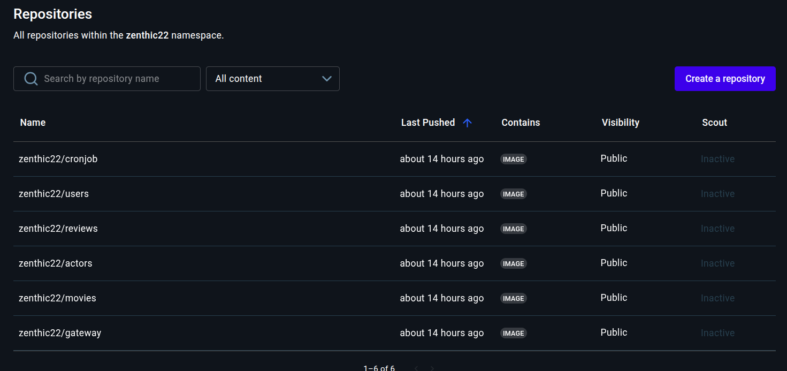

<p>UNIVERSIDAD DE SAN CARLOS DE GUATEMALA</p>
<p>FACULTAD DE INGENIERIA</p>
<p>ESCUELA DE CIENCIAS Y SISTEMAS</p>
<p>SOFTWARE AVANZADO</p>
<p>TUTOR: DIEGO MOLINA</p>

---

---

---

---

---

---

---

### <center><h1>PRACTICA 7</h1></center>
<center>Despliegue de un Clúster en la Nube con
Kubespray y Pipeline CI/CD</center>

---

---

---

---

| NOMBRE                      | CARNET    |
|-----------------------------|:---------:|
| ERICK ABDUL CHACON BARILLAS | 201807169 |

---

---

---

---

---

---

---

---

---

---

## Introducción

Este proyecto implementa una arquitectura de microservicios desplegada en un clúster de Kubernetes configurado con **Kubespray** en Google Cloud Platform (GCP).  
Cada servicio (actors, movies, reviews, users) se comunica internamente mediante DNS, y el **API Gateway** actúa como único punto de entrada externo mediante un **NodePort (32001)**.

## Configuración del clúster con kubespray

### 2.1. Requisitos
- 1 nodo **master** y 2 **workers** (GCP)
- Ubuntu 22.04
- Python3, pip, ansible y kubectl instalados
- Llaves SSH configuradas para acceso sin contraseña

### 2.2. Clonacion de Kubespray
```bash
git clone https://github.com/kubernetes-sigs/kubespray.git
cd kubespray
pip install -r requirements.txt
```

### 2.3. Inventario de nodos
```bash
cp -rfp inventory/sample inventory/mycluster
declare -a IPS=(10.128.0.5 10.128.0.6 10.128.0.7)
CONFIG_FILE=inventory/mycluster/hosts.yaml python3 contrib/inventory_builder/inventory.py ${IPS[@]}
```

Edición del archivo ```inventory/mycluster/group_vars/all/all.yml``` y ```k8s_cluster.yml``` para definir versión de Kubernetes y red ```Calico```.

### 2.4. Despliegue del clúster
```ansible-playbook -i inventory/mycluster/hosts.yaml --become --become-user=root cluster.yml```

### 2.5. Verificación
```bash
kubectl get nodes -o wide
kubectl get pods -A
```

Clúster creado exitosamente con 1 master y 2 workers.

### 3. Configuración de la infraestructura

Infraestructura en la nube (GCP)
- Red: `default` con rango interno `10.128.0.0/20`
- Nodos:
  - master-1: 10.128.0.5  (EXTERNAL_IP: 35.194.28.132)
  - worker-1: 10.128.0.7  (EXTERNAL_IP: 34.10.139.42)
  - worker-2: 10.128.0.6  (EXTERNAL_IP: 136.113.195.179)
- CNI: Calico
- Almacenamiento: Volúmenes persistentes mediante `emptyDir` o `PVC` temporales
- Firewall: regla `allow-gateway-nodeport` para exponer puerto TCP 32001

### 4. Despliegue de microservicios

Cada microservicio tiene sus manifiestos en la carpeta `k8s/`:

- Deployment
- Service
- HPA
- NetworkPolicy

Actores:

- deployment.yaml:

```yaml
apiVersion: apps/v1
kind: Deployment
metadata:
  name: actors
  namespace: sa-p5
  labels:
    app: actors
    app.kubernetes.io/name: actors
    app.kubernetes.io/part-of: sa-p5
spec:
  replicas: 2
  revisionHistoryLimit: 3
  selector:
    matchLabels:
      app: actors
  template:
    metadata:
      labels:
        app: actors
        app.kubernetes.io/name: actors
        app.kubernetes.io/part-of: sa-p5
    spec:
      containers:
        - name: actors
          image: docker.io/zenthic22/actors:c4b58f6
          imagePullPolicy: IfNotPresent
          ports:
            - name: http
              containerPort: 4000
          env:
            - name: PORT
              value: "4000"
            - name: DB_HOST
              value: "mysql.sa-p5.svc.cluster.local"
            - name: DB_PORT
              value: "3306"
            - name: DB_NAME
              value: "actors_db"
            - name: DB_USER
              valueFrom:
                secretKeyRef:
                  name: mysql-secret
                  key: MYSQL_USER
            - name: DB_PASSWORD
              valueFrom:
                secretKeyRef:
                  name: mysql-secret
                  key: MYSQL_PASSWORD
          readinessProbe:
            httpGet:
              path: /healthz
              port: http
            initialDelaySeconds: 5
            periodSeconds: 5
            timeoutSeconds: 2
            failureThreshold: 6
          livenessProbe:
            httpGet:
              path: /healthz
              port: http
            initialDelaySeconds: 20
            periodSeconds: 10
            timeoutSeconds: 2
            failureThreshold: 3
          resources:
            requests:
              cpu: "200m"
              memory: "256Mi"
            limits:
              cpu: "500m"
              memory: "512Mi"
```

- hpa.yaml:

```yaml
apiVersion: autoscaling/v2
kind: HorizontalPodAutoscaler
metadata:
  name: actors
  namespace: sa-p5
  labels:
    app: actors
spec:
  scaleTargetRef:
    apiVersion: apps/v1
    kind: Deployment
    name: actors
  minReplicas: 2
  maxReplicas: 4
  metrics:
    - type: Resource
      resource:
        name: cpu
        target:
          type: Utilization
          averageUtilization: 80
```

- netpol.yaml:

```yaml
apiVersion: v1
kind: Service
metadata:
  name: actors
  namespace: sa-p5
  labels:
    app: actors
    app.kubernetes.io/name: actors
spec:
  selector:
    app: actors
  ports:
    - name: http
      port: 4000
      targetPort: http
  type: ClusterIP
```

- allow-all-internal.yaml:

```yaml
apiVersion: networking.k8s.io/v1
kind: NetworkPolicy
metadata:
  name: allow-all-internal
  namespace: sa-p5
spec:
  podSelector: {}
  policyTypes: ["Ingress","Egress"]
  ingress:
    - from:
        - podSelector: {}   # Permite tráfico interno entre pods del mismo namespace
  egress:
    - to:
        - podSelector: {}
```

Movies:

- deployment.yaml:

```yaml
apiVersion: apps/v1
kind: Deployment
metadata:
  name: movies
  namespace: sa-p5
  labels:
    app: movies
    app.kubernetes.io/name: movies
    app.kubernetes.io/part-of: sa-p5
spec:
  replicas: 2
  revisionHistoryLimit: 3
  selector:
    matchLabels:
      app: movies
  template:
    metadata:
      labels:
        app: movies
        app.kubernetes.io/name: movies
        app.kubernetes.io/part-of: sa-p5
    spec:
      containers:
        - name: movies
          image: docker.io/zenthic22/movies:c4b58f6
          imagePullPolicy: IfNotPresent
          ports:
            - name: http
              containerPort: 3000
          env:
            - name: PORT
              value: "3000"
            - name: DB_HOST
              value: "mysql.sa-p5.svc.cluster.local"
            - name: DB_PORT
              value: "3306"
            - name: DB_NAME
              value: "movies_db"
            - name: DB_USER
              valueFrom:
                secretKeyRef:
                  name: mysql-secret
                  key: MYSQL_USER
            - name: DB_PASSWORD
              valueFrom:
                secretKeyRef:
                  name: mysql-secret     # nombre del Secret
                  key: MYSQL_PASSWORD    # clave dentro del Secret
          readinessProbe:
            httpGet: { path: /healthz, port: http }
            initialDelaySeconds: 5
            periodSeconds: 5
            timeoutSeconds: 2
            failureThreshold: 6
          livenessProbe:
            httpGet: { path: /healthz, port: http }
            initialDelaySeconds: 20
            periodSeconds: 10
            timeoutSeconds: 2
            failureThreshold: 3
          resources:
            requests: { cpu: "200m", memory: "256Mi" }
            limits:   { cpu: "500m", memory: "512Mi" }
```

- hpa.yaml:

```yaml
apiVersion: autoscaling/v2
kind: HorizontalPodAutoscaler
metadata:
  name: movies
  namespace: sa-p5
  labels:
    app: movies
spec:
  scaleTargetRef:
    apiVersion: apps/v1
    kind: Deployment
    name: movies
  minReplicas: 2
  maxReplicas: 3
  metrics:
    - type: Resource
      resource:
        name: cpu
        target:
          type: Utilization
          averageUtilization: 80
```

- netpol.yaml:

```yaml
apiVersion: networking.k8s.io/v1
kind: NetworkPolicy
metadata:
  name: movies-allow
  namespace: sa-p5
spec:
  podSelector:
    matchLabels:
      app: movies
  policyTypes: ["Ingress","Egress"]
  ingress:
    - from:
        - namespaceSelector:
            matchLabels:
              kubernetes.io/metadata.name: sa-p5
          podSelector:
            matchLabels:
              app: gateway
      ports:
        - protocol: TCP
          port: 3000
  egress:
    - to:
        - namespaceSelector:
            matchLabels:
              kubernetes.io/metadata.name: sa-p5
          podSelector:
            matchLabels:
              app: mysql
      ports:
        - protocol: TCP
          port: 3306
    - to:
        - namespaceSelector:
            matchLabels:
              kubernetes.io/metadata.name: kube-system
          podSelector:
            matchLabels:
              k8s-app: kube-dns
      ports:
        - { protocol: UDP, port: 53 }
        - { protocol: TCP, port: 53 }
```

- service.yaml:

```yaml
apiVersion: v1
kind: Service
metadata:
  name: movies
  namespace: sa-p5
  labels:
    app: movies
spec:
  selector:
    app: movies
  ports:
    - name: http
      port: 3000
      targetPort: http
  type: ClusterIP
```

- allow-all-internal.yaml:

```yaml
apiVersion: networking.k8s.io/v1
kind: NetworkPolicy
metadata:
  name: allow-all-internal
  namespace: sa-p5
spec:
  podSelector: {}
  policyTypes: ["Ingress","Egress"]
  ingress:
    - from:
        - podSelector: {}
  egress:
    - to:
        - podSelector: {}
```

Reviews:

- deployment.yaml:

```yaml
apiVersion: apps/v1
kind: Deployment
metadata:
  name: reviews
  namespace: sa-p5
  labels:
    app: reviews
    app.kubernetes.io/name: reviews
    app.kubernetes.io/part-of: sa-p5
spec:
  replicas: 2
  revisionHistoryLimit: 3
  selector:
    matchLabels:
      app: reviews
  template:
    metadata:
      labels:
        app: reviews
        app.kubernetes.io/name: reviews
        app.kubernetes.io/part-of: sa-p5
    spec:
      containers:
        - name: reviews
          image: docker.io/zenthic22/reviews:c4b58f6
          imagePullPolicy: IfNotPresent
          ports:
            - containerPort: 5002
              name: http
          env:
            - name: PORT
              value: "5002"
            - name: DB_HOST
              value: "mysql.sa-p5.svc.cluster.local"
            - name: DB_PORT
              value: "3306"
            - name: DB_NAME
              value: "reviews_db"
            - name: DB_USER
              valueFrom:
                secretKeyRef:
                  name: mysql-secret
                  key: MYSQL_USER
            - name: DB_PASSWORD
              valueFrom:
                secretKeyRef:
                  name: mysql-secret
                  key: MYSQL_PASSWORD
          readinessProbe:
            httpGet: { path: /healthz, port: http }
            initialDelaySeconds: 5
            periodSeconds: 5
            timeoutSeconds: 2
            failureThreshold: 6
          livenessProbe:
            httpGet: { path: /healthz, port: http }
            initialDelaySeconds: 15
            periodSeconds: 10
            timeoutSeconds: 2
            failureThreshold: 3
          resources:
            requests:
              cpu: "200m"
              memory: "256Mi"
            limits:
              cpu: "500m"
              memory: "512Mi"
```

- hpa.yaml:

```yaml
apiVersion: autoscaling/v2
kind: HorizontalPodAutoscaler
metadata:
  name: reviews
  namespace: sa-p5
  labels:
    app: reviews
spec:
  scaleTargetRef:
    apiVersion: apps/v1
    kind: Deployment
    name: reviews
  minReplicas: 2
  maxReplicas: 3
  metrics:
    - type: Resource
      resource:
        name: cpu
        target:
          type: Utilization
          averageUtilization: 80
```

- netpol.yaml:

```yaml
apiVersion: networking.k8s.io/v1
kind: NetworkPolicy
metadata:
  name: reviews-allow
  namespace: sa-p5
spec:
  podSelector:
    matchLabels:
      app: reviews
  policyTypes: ["Ingress","Egress"]
  ingress:
    - from:
        - namespaceSelector:
            matchLabels:
              kubernetes.io/metadata.name: sa-p5
          podSelector:
            matchLabels:
              app: gateway
      ports:
        - protocol: TCP
          port: 5002
  egress:
    - to:
        - namespaceSelector:
            matchLabels:
              kubernetes.io/metadata.name: sa-p5
          podSelector:
            matchLabels:
              app: mysql
      ports:
        - protocol: TCP
          port: 3306
    - to:
        - namespaceSelector:
            matchLabels:
              kubernetes.io/metadata.name: kube-system
          podSelector:
            matchLabels:
              k8s-app: kube-dns
      ports:
        - { protocol: UDP, port: 53 }
        - { protocol: TCP, port: 53 }
```

- service.yaml:

```yaml
apiVersion: v1
kind: Service
metadata:
  name: reviews
  namespace: sa-p5
  labels:
    app: reviews
spec:
  selector:
    app: reviews
  ports:
    - name: http
      port: 5002
      targetPort: http
  type: ClusterIP
```

- allow-all-internal.yaml:

```yaml
apiVersion: networking.k8s.io/v1
kind: NetworkPolicy
metadata:
  name: allow-all-internal
  namespace: sa-p5
spec:
  podSelector: {}
  policyTypes: ["Ingress","Egress"]
  ingress:
    - from:
        - podSelector: {}
  egress:
    - to:
        - podSelector: {}
```

Users:

- deployment.yaml:

```yaml
apiVersion: apps/v1
kind: Deployment
metadata:
  name: users
  namespace: sa-p5
  labels:
    app: users
    app.kubernetes.io/name: users
    app.kubernetes.io/part-of: sa-p5
spec:
  replicas: 2
  revisionHistoryLimit: 3
  selector:
    matchLabels:
      app: users
  template:
    metadata:
      labels:
        app: users
        app.kubernetes.io/name: users
        app.kubernetes.io/part-of: sa-p5
    spec:
      containers:
        - name: users
          image: docker.io/zenthic22/users:c4b58f6
          imagePullPolicy: IfNotPresent
          ports:
            - name: http
              containerPort: 5003
          env:
            - name: PORT
              value: "5003"
            - name: DB_HOST
              value: "mysql.sa-p5.svc.cluster.local"
            - name: DB_PORT
              value: "3306"
            - name: DB_NAME
              value: "users_db"
            - name: DB_USER
              valueFrom:
                secretKeyRef:
                  name: mysql-secret
                  key: MYSQL_USER
            - name: DB_PASSWORD
              valueFrom:
                secretKeyRef:
                  name: mysql-secret
                  key: MYSQL_PASSWORD
          readinessProbe:
            httpGet: { path: /healthz, port: http }
            initialDelaySeconds: 5
            periodSeconds: 5
            timeoutSeconds: 2
            failureThreshold: 6
          livenessProbe:
            httpGet: { path: /healthz, port: http }
            initialDelaySeconds: 20
            periodSeconds: 10
            timeoutSeconds: 2
            failureThreshold: 3
          resources:
            requests: { cpu: "200m", memory: "256Mi" }
            limits:   { cpu: "500m", memory: "512Mi" }
```

- hpa.yaml:

```yaml
apiVersion: autoscaling/v2
kind: HorizontalPodAutoscaler
metadata:
  name: users
  namespace: sa-p5
  labels:
    app: users
spec:
  scaleTargetRef:
    apiVersion: apps/v1
    kind: Deployment
    name: users
  minReplicas: 2
  maxReplicas: 3
  metrics:
    - type: Resource
      resource:
        name: cpu
        target:
          type: Utilization
          averageUtilization: 80
```

- netpol.yaml:

```yaml
apiVersion: networking.k8s.io/v1
kind: NetworkPolicy
metadata:
  name: users-allow
  namespace: sa-p5
spec:
  podSelector:
    matchLabels:
      app: users
  policyTypes: ["Ingress","Egress"]
  ingress:
    - from:
        - namespaceSelector:
            matchLabels:
              kubernetes.io/metadata.name: sa-p5
          podSelector:
            matchLabels:
              app: gateway
      ports:
        - protocol: TCP
          port: 5003
  egress:
    - to:
        - namespaceSelector:
            matchLabels:
              kubernetes.io/metadata.name: sa-p5
          podSelector:
            matchLabels:
              app: mysql
      ports:
        - protocol: TCP
          port: 3306
    - to:
        - namespaceSelector:
            matchLabels:
              kubernetes.io/metadata.name: kube-system
          podSelector:
            matchLabels:
              k8s-app: kube-dns
      ports:
        - { protocol: UDP, port: 53 }
        - { protocol: TCP, port: 53 }
```

- service.yaml:

```yaml
apiVersion: v1
kind: Service
metadata:
  name: users
  namespace: sa-p5
  labels:
    app: users
spec:
  selector:
    app: users
  ports:
    - name: http
      port: 5003
      targetPort: http
  type: ClusterIP
```

Gateway:

- configmap.yaml:

```yaml
apiVersion: v1
kind: ConfigMap
metadata:
  name: gateway-config
  namespace: sa-p5
data:
  PORT: "4001"
  ACTORS_SERVICE: "http://actors.sa-p5.svc.cluster.local:4000"
  MOVIES_SERVICE: "http://movies.sa-p5.svc.cluster.local:3000"
  REVIEWS_SERVICE: "http://reviews.sa-p5.svc.cluster.local:5002"
  USERS_SERVICE: "http://users.sa-p5.svc.cluster.local:5003"
```

- deployment.yaml:

```yaml
apiVersion: apps/v1
kind: Deployment
metadata:
  name: gateway
  namespace: sa-p5
  labels: { app: gateway }
spec:
  replicas: 2
  revisionHistoryLimit: 3
  selector:
    matchLabels: { app: gateway }
  template:
    metadata:
      labels: { app: gateway }
    spec:
      containers:
        - name: gateway
          image: docker.io/zenthic22/gateway:c4b58f6
          imagePullPolicy: IfNotPresent
          ports:
            - name: http
              containerPort: 4001
          envFrom:
            - configMapRef:
                name: gateway-config
          readinessProbe:
            httpGet: { path: /healthz, port: http }
            initialDelaySeconds: 5
            periodSeconds: 5
          livenessProbe:
            httpGet: { path: /healthz, port: http }
            initialDelaySeconds: 20
            periodSeconds: 10
          resources:
            requests: { cpu: "200m", memory: "256Mi" }
            limits:   { cpu: "500m", memory: "512Mi" }
```

- hpa.yaml:

```yaml
apiVersion: autoscaling/v2
kind: HorizontalPodAutoscaler
metadata:
  name: gateway
  namespace: sa-p5
  labels: { app: gateway }
spec:
  scaleTargetRef:
    apiVersion: apps/v1
    kind: Deployment
    name: gateway
  minReplicas: 2   # HA recomendada
  maxReplicas: 4
  metrics:
    - type: Resource
      resource:
        name: cpu
        target:
          type: Utilization
          averageUtilization: 75
```

- netpol.yaml:

```yaml
apiVersion: networking.k8s.io/v1
kind: NetworkPolicy
metadata:
  name: gateway-policy
  namespace: sa-p5
spec:
  podSelector:
    matchLabels:
      app: gateway
  policyTypes: ["Ingress","Egress"]
  ingress:
    # 1) Permite tráfico externo (NodePort -> pod) al puerto 4001
    - from:
        - ipBlock:
            cidr: 0.0.0.0/0
      ports:
        - protocol: TCP
          port: 4001
    # 2) (Opcional) Mantén permiso desde el Ingress Controller por si lo reactivas
    - from:
        - namespaceSelector:
            matchLabels:
              kubernetes.io/metadata.name: ingress-nginx
          podSelector:
            matchLabels:
              app.kubernetes.io/name: ingress-nginx
              app.kubernetes.io/component: controller
      ports:
        - protocol: TCP
          port: 4001
  egress:
    # Microservicios internos
    - to:
        - namespaceSelector:
            matchLabels:
              kubernetes.io/metadata.name: sa-p5
          podSelector:
            matchExpressions:
              - key: app
                operator: In
                values: ["actors","movies","reviews","users"]
      ports:
        - { protocol: TCP, port: 4000 }
        - { protocol: TCP, port: 3000 }
        - { protocol: TCP, port: 5002 }
        - { protocol: TCP, port: 5003 }
    # DNS
    - to:
        - namespaceSelector:
            matchLabels:
              kubernetes.io/metadata.name: kube-system
          podSelector:
            matchLabels:
              k8s-app: kube-dns
      ports:
        - { protocol: UDP, port: 53 }
        - { protocol: TCP, port: 53 }
```

- service.yaml:

```yaml
apiVersion: v1
kind: Service
metadata:
  name: gateway
  namespace: sa-p5
  labels:
    app: gateway
spec:
  selector:
    app: gateway
  type: NodePort
  ports:
    - name: http
      port: 4001         # Puerto interno del servicio
      targetPort: http   # Nombre del puerto en el contenedor
      nodePort: 32001    # Puerto expuesto en los nodos (puedes cambiarlo si está ocupado)
```

- allow-gateway-from-anys.yaml:

```yaml
apiVersion: networking.k8s.io/v1
kind: NetworkPolicy
metadata:
  name: allow-gateway-from-anyns
  namespace: sa-p5
spec:
  podSelector:
    matchLabels:
      app: gateway
  policyTypes: ["Ingress"]
  ingress:
    - from:
        - namespaceSelector: {}   # permite desde cualquier namespace
      ports:
        - protocol: TCP
          port: 4001
```

### 5. Seguridad y comunicación interna

Seguridad y Network Policies

- Politica `default-deny` por defecto.
- Cada microservicio tiene su `*-allow.yaml` para permitir tráfico solo desde el gateway.
- Durante pruebas se usó `allow-all-internal.yaml` para depuración controlada.

Ejemplo de comunicación válida:

```bash
kubectl run curl-test --rm -it --image=curlimages/curl -- \
  curl -i http://users.sa-p5.svc.cluster.local:5003/healthz
```

### 6. Exposición del gateway

API Gateway

El Gateway actúa como único punto de entrada al sistema.
- Tipo de servicio: **NodePort**
- Puerto expuesto: **32001**
- IPs accesibles:
  - http://35.194.28.132:32001/
  - http://34.10.139.42:32001/
  - http://136.113.195.179:32001/

Verificación:
```bash
curl -i http://35.194.28.132:32001/healthz
```

Respuesta: `HTTP/1.1 200 OK`

### 7. Pipeline CI/CD con Github Actions

El pipeline CI/CD se implementó mediante **Github Actions**, automatizando:

1. **Build** - Compila la imagen Docker de cada microservicio.
2. **Test** - Ejecuta pruebas unitarias o de salid (según el servicio).
3. **Push** - Publica la imagen en Docker Hub con el tag del commit.
4. **Deploy** - Actualiza automáticamente el despliegue en el clúster de Kubernetes.

### Configuración

Cada repositorio contiene un archivo de workflow en `.github/workflows/ci-cd.yml` con el siguiente contenido:

```yaml
name: CI/CD – SA P7

on:
  push:
    branches: [ main ]
  workflow_dispatch:

env:
  REGISTRY_USER: ${{ secrets.DOCKERHUB_USER }}
  REGISTRY_TOKEN: ${{ secrets.DOCKERHUB_TOKEN }}
  REGISTRY: docker.io
  REPO: zenthic22
  SERVICES: |
    gateway
    movies
    actors
    reviews
    users
    cronjob-runner

jobs:
  build_push:
    name: Build & Push Docker images
    runs-on: ubuntu-latest
    permissions: { contents: read, packages: write }

    steps:
      - name: Checkout
        uses: actions/checkout@v4

      - name: Set short SHA
        id: vars
        run: echo "SHORT_SHA=${GITHUB_SHA::7}" >> $GITHUB_OUTPUT

      - name: Set up Buildx
        uses: docker/setup-buildx-action@v3

      - name: Login to Docker Hub
        uses: docker/login-action@v3
        with:
          registry: ${{ env.REGISTRY }}
          username: ${{ env.REGISTRY_USER }}
          password: ${{ env.REGISTRY_TOKEN }}

      - name: Build & Push (loop)
        run: |
          set -euo pipefail
          TAG=${{ steps.vars.outputs.SHORT_SHA }}
          for svc in $SERVICES; do
            case "$svc" in
              cronjob-runner) ctx="cronjob-runner"; img="$REPO/cronjob";;
              *)               ctx="$svc";           img="$REPO/$svc";;
            esac
            echo "==> Building $img from $ctx"
            docker build -t $REGISTRY/$img:latest -t $REGISTRY/$img:$TAG $ctx
            docker push $REGISTRY/$img:latest
            docker push $REGISTRY/$img:$TAG
          done
        env:
          REGISTRY: ${{ env.REGISTRY }}
          REPO: ${{ env.REPO }}
          SERVICES: ${{ env.SERVICES }}

      - name: Upload image tag artifact
        run: echo "${{ steps.vars.outputs.SHORT_SHA }}" > image_tag.txt
      - uses: actions/upload-artifact@v4
        with: { name: image_tag, path: image_tag.txt }

  deploy_via_ssh:
    name: Deploy to K8s (via SSH on master)
    runs-on: ubuntu-latest
    needs: [build_push]

    steps:
      - name: Checkout
        uses: actions/checkout@v4

      - name: Download image tag
        uses: actions/download-artifact@v4
        with: { name: image_tag, path: . }

      - name: Read tag
        id: tag
        run: echo "TAG=$(cat image_tag.txt)" >> $GITHUB_OUTPUT

      - name: Prepare deploy script
        run: |
          cat > deploy.sh <<'EOS'
          set -euo pipefail

          NS=sa-p5
          TAG="$1"
          TIMEOUT=300s

          echo "[*] kubectl context:"
          kubectl cluster-info || true

          echo "[*] Apply namespace first"
          kubectl apply -f k8s/namespace.yaml

          echo "[*] Apply app manifests"
          kubectl -n "$NS" apply -f k8s/mysql/
          kubectl -n "$NS" apply -f k8s/actors/
          kubectl -n "$NS" apply -f k8s/movies/
          kubectl -n "$NS" apply -f k8s/reviews/
          kubectl -n "$NS" apply -f k8s/users/
          kubectl -n "$NS" apply -f k8s/gateway/
          kubectl -n "$NS" apply -f k8s/cronjob/

          # Función helper para esperar rollout con diagnóstico en fallo
          wait_rollout() {
            local kind="$1" name="$2" label="$3"
            echo "[*] Waiting rollout $kind/$name ..."
            if ! kubectl -n "$NS" rollout status "$kind/$name" --timeout="$TIMEOUT"; then
              echo "[!] Rollout failed for $kind/$name. Dumping diagnostics..."
              kubectl -n "$NS" describe "$kind/$name" || true
              [ -n "$label" ] && kubectl -n "$NS" get pods -l "$label" -o wide || true
              [ -n "$label" ] && kubectl -n "$NS" describe pods -l "$label" || true
              exit 1
            fi
          }

          echo "[*] Scale down to 1 replica to ease quota pressure"
          kubectl -n "$NS" scale deploy/actors  --replicas=1 || true
          kubectl -n "$NS" scale deploy/movies  --replicas=1 || true
          kubectl -n "$NS" scale deploy/reviews --replicas=1 || true
          kubectl -n "$NS" scale deploy/users   --replicas=1 || true
          kubectl -n "$NS" scale deploy/gateway --replicas=1 || true

          echo "[*] Patch images with immutable tag $TAG"
          kubectl -n "$NS" set image deploy/actors   actors=docker.io/zenthic22/actors:$TAG
          kubectl -n "$NS" set image deploy/movies   movies=docker.io/zenthic22/movies:$TAG
          kubectl -n "$NS" set image deploy/reviews  reviews=docker.io/zenthic22/reviews:$TAG
          kubectl -n "$NS" set image deploy/users    users=docker.io/zenthic22/users:$TAG
          kubectl -n "$NS" set image deploy/gateway  gateway=docker.io/zenthic22/gateway:$TAG

          echo "[*] Patch cronjob image"
          kubectl -n "$NS" patch cronjob/cron-insert --type='json' \
            -p="[{'op':'replace','path':'/spec/jobTemplate/spec/template/spec/containers/0/image','value':'docker.io/zenthic22/cronjob:$TAG'}]"

          # Esperar rollouts (1 réplica)
          wait_rollout deploy actors  "app=actors"
          wait_rollout deploy movies  "app=movies"
          wait_rollout deploy reviews "app=reviews"
          wait_rollout deploy users   "app=users"
          wait_rollout deploy gateway "app=gateway"

          echo "[*] Scale up back to 2 replicas"
          kubectl -n "$NS" scale deploy/actors  --replicas=2
          kubectl -n "$NS" scale deploy/movies  --replicas=2
          kubectl -n "$NS" scale deploy/reviews --replicas=2
          kubectl -n "$NS" scale deploy/users   --replicas=2
          kubectl -n "$NS" scale deploy/gateway --replicas=2

          # Esperar nuevamente (por si tarda en programar la 2da réplica)
          wait_rollout deploy actors  "app=actors"
          wait_rollout deploy movies  "app=movies"
          wait_rollout deploy reviews "app=reviews"
          wait_rollout deploy users   "app=users"
          wait_rollout deploy gateway "app=gateway"

          echo "[*] Resumen:"
          kubectl -n "$NS" get pods,svc,ingress,hpa
          EOS
          chmod +x deploy.sh

      - name: Copy repo (k8s/ + script) to master
        uses: appleboy/scp-action@v0.1.7
        with:
            host: ${{ secrets.SSH_HOST }}
            username: ${{ secrets.SSH_USER }}
            key: ${{ secrets.SSH_KEY }}
            port: 22
            source: "./k8s/**,deploy.sh"
            target: "/home/${{ secrets.SSH_USER }}/sa-p5/"

      - name: SSH deploy
        uses: appleboy/ssh-action@v1.2.0
        with:
            host: ${{ secrets.SSH_HOST }}
            username: ${{ secrets.SSH_USER }}
            key: ${{ secrets.SSH_KEY }}
            port: 22
            script_stop: true
            command_timeout: 30m
            envs: REPO
            script: |
                set -euo pipefail
                echo "[preflight] whoami: $(whoami), host: $(hostname)"
                mkdir -p ~/sa-p5
                cd ~/sa-p5
                # kubeconfig del master
                if [ ! -f ~/.kube/config ]; then
                    mkdir -p ~/.kube
                    sudo cat /etc/kubernetes/admin.conf > ~/.kube/config
                    chmod 600 ~/.kube/config
                fi
                ./deploy.sh "${{ steps.tag.outputs.TAG }}"
```

### Variables y secretos utilizados

Los secretos configurados en Github -> Settings -> Secrets and variables -> Actions fueron:


| variable | descripcion |
|----------|-------------|
| DOCKERHUB_TOKEN | token de acceso a Docker Hub |
| DOCKERHUB_USER | usuario de Docker Hub |
| SSH_HOST | ip publica para tener comunicacion con el clúster (en este caso master-1) |
| SSH_KEY | llave tipo .pub para realizar tunel ssh con las vms |
| SSH_USER | usuario con el que se conectara con el cluster (usuario GCP `ubuntu`) |

### Flujo completo
1. Se realiza un **push a la rama** `main`.
2. Github Actions ejecuta las etapas de **build**, **push** y **deploy**.


3. La imagen resultante se publica como `docker.io/zenthic22/<servicio>:<commit_sha>`



4. El clúster se actualiza automaticamente con `kubectl apply -f k8s/
`


### Resultado esperado
* Las imagenes se actualizan en Docker Hub automáticamente.
* Kubernetes obtiene las nuevas versiones del código sin intervención manual.
* En `kubectl get pods -n sa-p5`, los pods se reinician con la nueva imagen.

Resumen


Flujo 1


Flujo 3


### 8. Resultado final


### 9. Contratos de microservicios

https://app.getpostman.com/join-team?invite_code=9e8104ed00b7070ec0ef43b81e4dad553c0f01660d2e16edb5cfe0c00edaa1ec&target_code=3830c3eb7c0376a4e50db820306e8f39

### 10. Diagrama de arquitectura

